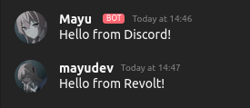

# revcord

(WIP)
An easy to setup bridge for Discord and Revolt (an awesome open source Discord-inspired chat app).

## Features
- [x] Bridge messages between platforms
- [x] Bridge attachments
- [x] Bridge replies
- [x] Bridge message edit and delete 
- [x] Seamlessly display user information

 

## Setup

Important: this bot is meant to be used in one server (Discord+Revolt), but can be used in few as long as they share the same admin.

1. Clone this repository
```sh
git clone https://github.com/mayudev/revcord
cd revcord
```
2. Install dependencies
```sh
npm install
```
3. Create a bot in Discord ([Guide](https://discordjs.guide/preparations/setting-up-a-bot-application.html#creating-your-bot)) and Revolt (Open user settings -> `My bots` -> `Create a bot` -> Name it however you want -> Done.)
4. Revcord uses environment variables to store tokens. The easiest way is to create a `.env` file (yes, a file called `.env`):
```
DISCORD_TOKEN = ...
REVOLT_TOKEN = ...
```
Of course, replace ... with tokens.

5. Build the bot
```
npm run build
```
6. Apply configuation (see below)
7. Run the bot
   
You have to use this weird command because of `revolt.js` stuff. I'm going to make it easier in the future.
```
node --experimental-specifier-resolution=node build/index.js
```
8. Invite the bot to a Revolt and Discord server
   
**Important** Make sure the bot can, obviously, read and send messages on both platforms. Moreover:

On Revolt: Add a role with the `Masquerade` permission to the bot.

On Discord: Make sure the bot has the `Manage Webhooks` permission and the ability to use slash commands. It will warn you if you don't (it just won't work without it).

## Configuration

### with commands

You can use either slash commands on Discord or rc! prefix on Revolt (use rc!help to show all commands)

You need the `Administrator` permission on Discord or be the server owner in Revolt to use those commands.

#### Connecting a Discord and Revolt channel
**From Discord**: Use the `/connect <Revolt channel name or ID>` command

**From Revolt**: Use the `rc!connect <Discord channel name or ID>` command

#### Removing the connection
Just call either `/disconnect` in the connected Discord channel or `rc!disconnect` in Revolt.

#### Showing connections
You can show current connections by calling `/connections` in Discord or `rc!connections` in Revolt.

### with mappings.json (not recommended)
1. Create a `mappings.json` file in the root directory.
2. Use the following format:
```json
[
  {
    "discord": "discord_channel_id",
    "revolt": "revolt_channel_id"
  },
  {
    "discord": "another_discord_channel_id",
    "revolt": "another_revolt_channel_id"
  }
]
```
